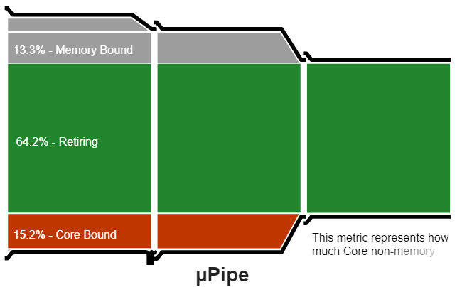
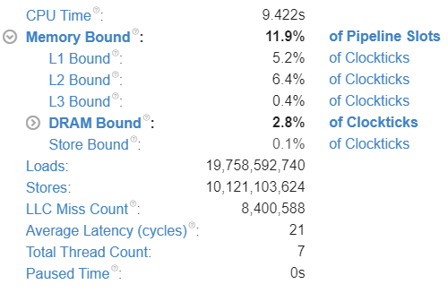
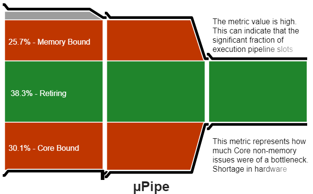
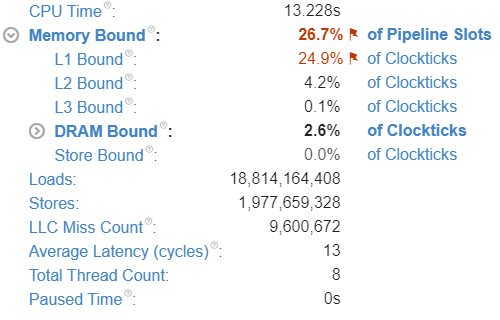

# Scalar version

## Bechmarks

```
|      Method |         Size |         Mean |      Error |     StdDev | Ratio | RatioSD | CacheMisses/Op | LLCReference/Op | LLCMisses/Op |
|------------ |------------- |-------------:|-----------:|-----------:|------:|--------:|---------------:|----------------:|-------------:|
| ColumnMajor |   (300, 200) |     36.75 μs |   0.363 μs |   0.321 μs |  1.00 |    0.00 |              9 |           6,642 |            9 |
|    RowMajor |   (300, 200) |     62.03 μs |   0.770 μs |   0.643 μs |  1.69 |    0.02 |             14 |           6,196 |           14 |
|             |              |              |            |            |       |         |                |                 |              |
| ColumnMajor |   (200, 300) |     37.58 μs |   0.590 μs |   0.552 μs |  1.00 |    0.00 |             10 |           5,695 |           10 |
|    RowMajor |   (200, 300) |     65.97 μs |   1.268 μs |   1.245 μs |  1.76 |    0.04 |             17 |           6,441 |           17 |
|             |              |              |            |            |       |         |                |                 |              |
| ColumnMajor |   (300, 300) |     55.63 μs |   0.900 μs |   1.071 μs |  1.00 |    0.00 |             18 |           8,872 |           18 |
|    RowMajor |   (300, 300) |     97.33 μs |   1.312 μs |   1.163 μs |  1.74 |    0.04 |             36 |           8,832 |           36 |
|             |              |              |            |            |       |         |                |                 |              |
| ColumnMajor | (3000, 2000) |  4,040.83 μs |  52.243 μs |  48.868 μs |  1.00 |    0.00 |        364,940 |         588,556 |      364,973 |
|    RowMajor | (3000, 2000) |  7,173.77 μs | 120.028 μs | 112.274 μs |  1.78 |    0.04 |        446,737 |         664,324 |      446,769 |
|             |              |              |            |            |       |         |                |                 |              |
| ColumnMajor | (2000, 3000) |  4,013.95 μs |  48.446 μs |  40.455 μs |  1.00 |    0.00 |        380,669 |         615,647 |      380,699 |
|    RowMajor | (2000, 3000) |  7,153.47 μs | 137.343 μs | 134.889 μs |  1.79 |    0.04 |        446,702 |         657,666 |      446,738 |
|             |              |              |            |            |       |         |                |                 |              |
| ColumnMajor | (3000, 3000) |  6,838.31 μs | 135.392 μs | 337.173 μs |  1.00 |    0.00 |        640,010 |       1,029,140 |      640,052 |
|    RowMajor | (3000, 3000) | 11,716.38 μs |  82.080 μs |  76.778 μs |  1.84 |    0.13 |        679,588 |         976,569 |      679,635 |
```

## VTune Profiler

### Column Major

#### Microarchitecture Analysis



#### Memory Access



### Row Major

#### Microarchitecture Analysis



#### Memory Access



# Vectorized Version

## Bechmarks

```
|          Method |       Mean |    Error |   StdDev | Ratio | RatioSD | CacheMisses/Op | LLCReference/Op | LLCMisses/Op |
|---------------- |-----------:|---------:|---------:|------:|--------:|---------------:|----------------:|-------------:|
|     ColumnMajor |   753.4 μs | 14.90 μs | 34.24 μs |  1.00 |    0.00 |         53,503 |         111,251 |       53,507 |
| ColumnMajorSimd |   377.6 μs |  5.96 μs |  4.98 μs |  0.49 |    0.03 |         38,422 |         107,429 |       38,424 |
|        RowMajor | 1,261.5 μs |  7.53 μs |  6.68 μs |  1.66 |    0.09 |         64,138 |         112,383 |       64,144 |
```

## Machine Info

``` ini

BenchmarkDotNet=v0.12.1, OS=Windows 10.0.19041.572 (2004/?/20H1)
Intel Core i7-7700HQ CPU 2.80GHz (Kaby Lake), 1 CPU, 8 logical and 4 physical cores
.NET Core SDK=5.0.100-preview.7.20366.6
  [Host]     : .NET Core 5.0.0 (CoreCLR 5.0.20.36411, CoreFX 5.0.20.36411), X64 RyuJIT
  DefaultJob : .NET Core 5.0.0 (CoreCLR 5.0.20.36411, CoreFX 5.0.20.36411), X64 RyuJIT


```
